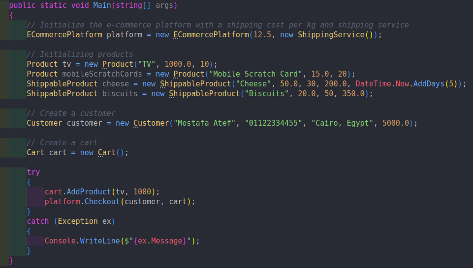
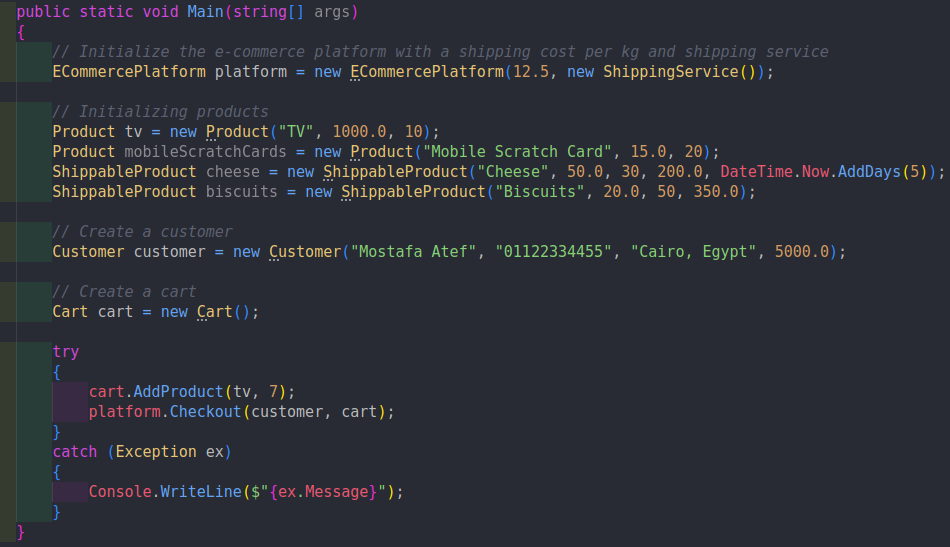
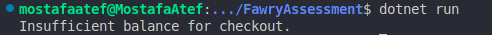
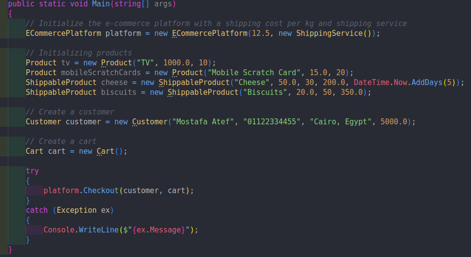
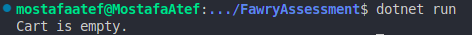
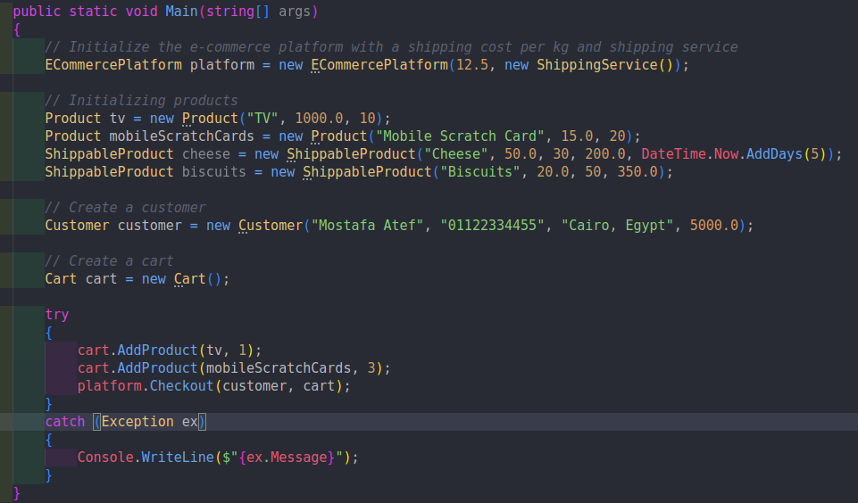
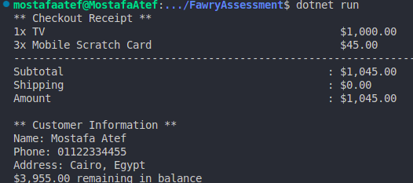
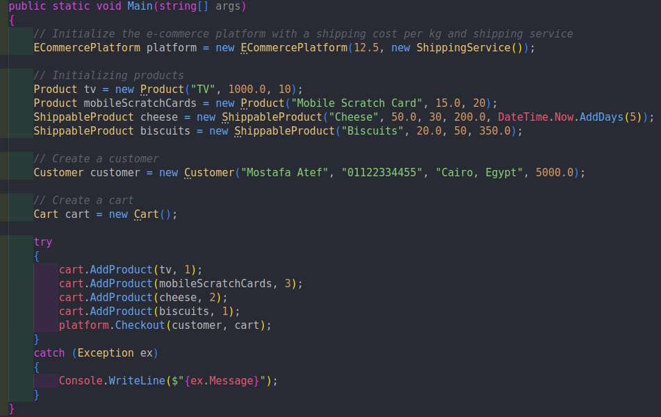
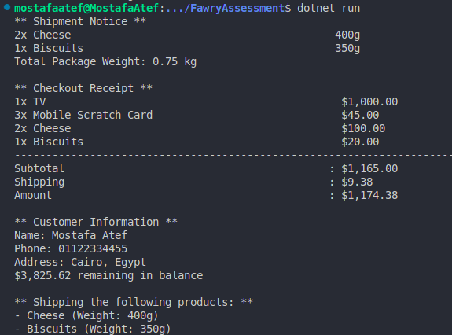

# E-Commerce System

Fawry Rise Journey

Full Stack Development Internship Challenge

A C# console application demonstrating an e-commerce platform with shopping cart functionality, shipping calculations, and customer management system.

## Project Structure

```
FawryAssessment/
├── Models/
│   ├── Cart.cs                   # Shopping cart with business logic
│   ├── CartItem.cs               # cart item structure
│   ├── Customer.cs               # Customer profile and balance
│   ├── ECommercePlatform.cs      # Main platform orchestration
│   ├── Product.cs                # Base product entity
│   ├── ShippableCartItem.cs      # Shippable product cart item
│   └── ShippableProduct.cs       # product with weight and can be shipped
├── Interfaces/
│   └── IShippableProduct.cs      # Contract for shippable items
├── Services/
│   └── ShippingService.cs        # Shipping operations handler
└── Program.cs                    # Application entry point & demos
```

## Screenshots




---




---




---




---




---
